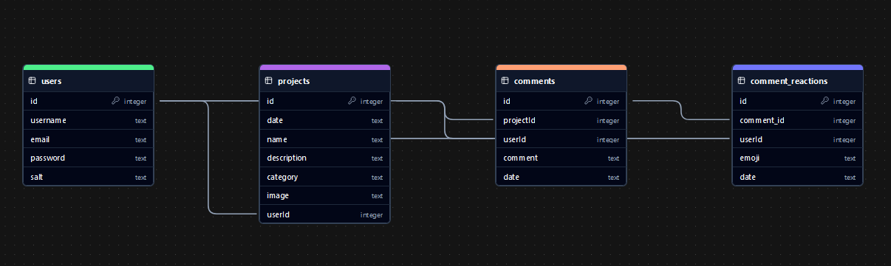

# DIY Project Sharing Platform

## Demo
https://www.youtube.com/watch?v=9aLlv0VMlj4

## Overview

A platform for sharing and discovering Do It Yourself (DIY) projects, from crafts to tech innovations. Whether you enjoy woodworking, home improvement, or creative electronics, this is the place to get inspired and inspire others.

## Project Structure

```
diyable/
│
├── .dockerignore              
├── .env # Needed for admin
├── .gitignore
├── app.js
├── docker-compose.yml
├── Dockerfile
├── LICENSE           # MIT License
├── package-lock.json          # Generated automatically after `npm init -y`
├── package.json          
├── README.md         
│
├── actions-runner/             # For the github workflow
├── assets/
│   └── images/
│       └── android-chrome-192x192.png
│       └── android-chrome-512x512.png
│       └── apple-touch-icon.png
│       └── favicon-16x16.png
│       └── favicon-32x32.png
│       └── favicon.ico
│       └── ft_bg.png
│       └── logo-diyable.png
│       └── projet-artisanat-exemple.png
│       └── projet-iot-exemple.png
├── bdd/
│   └── diyable.db
├── views/
│   └── about.pug
│   └── contact.pug
│   └── index.pug
│   └── layout.pug
│   └── login.pug
│   └── projectDetail.pug
│   └── projets.pug
│   └── register.pug
├── public/
│   └── code/
│       └── jquery.min.js
│   └── style/
│       └── index.css
│
│
└── node_modules/              # Generated automatically after `npm install`
```

## Setting Up the Project

1. **Create the Project Directories**:
```sh
   mkdir -p diyable/views
   mkdir -p diyable/public/code
```

2. **Add jQuery Library**: 
   - Download the jQuery file from: [jQuery 3.7.1](https://cdnjs.cloudflare.com/ajax/libs/jquery/3.7.1/jquery.min.js) and save it in the `public/code/` directory.

3. **Initialize Node.js Project**:
```sh
   cd diyable/
   npm init -y
```

4. **Install Dependencies**:
```sh
   npm install express pug sqlite3 dotenv body-parser express-session
```

## Configuration in the .env
To use a specific address for the diyable app you can set the PORT var in the .env like that: PORT=5133 for example
With that you can easily set the address for the app in order to modify easily the port to avoid the following error Error: listen EADDRINUSE: address already in use :::5136

```txt
PORT=<Your_PORT>>
SESSION_SECRET=<Your_SESSION_SECRET>

ADMIN_USERNAME=<Your_ADMIN_USERNAME>
ADMIN_PASSWORD=<Your_ADMIN_PASSWORD>
ADMIN_EMAIL=<Your_ADMIN_EMAIL>
```

if you don't create the .env you got a warning like that: Les informations de l'admin ne sont pas entièrement définies dans les variables d'environnement.
And you can't have access to the admin account because the script use the .env to create the admin account.

## Docker Configuration

1. **Build Docker Image**:
```sh
   docker build -t diyable .
```

2. **Run Docker Container**:
```sh
   docker run -d -p 5010:5010 --name diyable-container diyable
```

3. **Access the Container** (optional, for debugging or inspection):
```sh
   docker exec -it diyable-container /bin/bash
```

## Alternative Method with Docker Compose

1. **Build and Run Using Docker Compose**:
```sh
   docker-compose build
   docker-compose up -d
```

2. **View Logs**:
```sh
   docker-compose logs -f
```

## Simple Method to Start the Application
To avoid the error of Error: secret option required for sessions you need to run the following command
```sh
   echo "SESSION_SECRET=$(openssl rand -hex 64)" >> .env
```

1. **Run Node Application Directly**:
```sh
   node app.js
```

# Schéma de la Base de Données



> This graph was made using [ChartDB](https://chartdb.io/).

Here is the structure of the database:

```json
{
  "fk_info": [
    {
      "schema": "",
      "table": "projects",
      "column": "userId",
      "foreign_key_name": "fk_projects_userId_users_id",
      "reference_schema": "",
      "reference_table": "users",
      "reference_column": "id",
      "fk_def": "FOREIGN KEY (userId) REFERENCES users(id) ON UPDATE NO ACTION ON DELETE NO ACTION"
    },
    {
      "schema": "",
      "table": "comments",
      "column": "projectId",
      "foreign_key_name": "fk_comments_projectId_projects_id",
      "reference_schema": "",
      "reference_table": "projects",
      "reference_column": "id",
      "fk_def": "FOREIGN KEY (projectId) REFERENCES projects(id) ON UPDATE NO ACTION ON DELETE NO ACTION"
    },
    {
      "schema": "",
      "table": "comments",
      "column": "userId",
      "foreign_key_name": "fk_comments_userId_users_id",
      "reference_schema": "",
      "reference_table": "users",
      "reference_column": "id",
      "fk_def": "FOREIGN KEY (userId) REFERENCES users(id) ON UPDATE NO ACTION ON DELETE NO ACTION"
    },
    {
      "schema": "",
      "table": "comment_reactions",
      "column": "comment_id",
      "foreign_key_name": "fk_comment_reactions_comment_id_comments_id",
      "reference_schema": "",
      "reference_table": "comments",
      "reference_column": "id",
      "fk_def": "FOREIGN KEY (comment_id) REFERENCES comments(id) ON UPDATE NO ACTION ON DELETE NO ACTION"
    },
    {
      "schema": "",
      "table": "comment_reactions",
      "column": "userId",
      "foreign_key_name": "fk_comment_reactions_userId_users_id",
      "reference_schema": "",
      "reference_table": "users",
      "reference_column": "id",
      "fk_def": "FOREIGN KEY (userId) REFERENCES users(id) ON UPDATE NO ACTION ON DELETE NO ACTION"
    }
  ],
  "pk_info": [
    {
      "schema": "",
      "table": "users",
      "field_count": 1,
      "column": "id",
      "pk_def": "PRIMARY KEY (id)"
    },
    {
      "schema": "",
      "table": "projects",
      "field_count": 1,
      "column": "id",
      "pk_def": "PRIMARY KEY (id)"
    },
    {
      "schema": "",
      "table": "comments",
      "field_count": 1,
      "column": "id",
      "pk_def": "PRIMARY KEY (id)"
    },
    {
      "schema": "",
      "table": "comment_reactions",
      "field_count": 1,
      "column": "id",
      "pk_def": "PRIMARY KEY (id)"
    }
  ],
  "columns": [
    {
      "schema": "",
      "table": "users",
      "name": "id",
      "type": "integer",
      "ordinal_position": 0,
      "nullable": "false",
      "collation": null,
      "character_maximum_length": null,
      "precision": null,
      "default": null
    },
    {
      "schema": "",
      "table": "users",
      "name": "username",
      "type": "text",
      "ordinal_position": 1,
      "nullable": "false",
      "collation": null,
      "character_maximum_length": null,
      "precision": null,
      "default": null
    },
    {
      "schema": "",
      "table": "users",
      "name": "email",
      "type": "text",
      "ordinal_position": 2,
      "nullable": "false",
      "collation": null,
      "character_maximum_length": null,
      "precision": null,
      "default": null
    },
    {
      "schema": "",
      "table": "users",
      "name": "password",
      "type": "text",
      "ordinal_position": 3,
      "nullable": "false",
      "collation": null,
      "character_maximum_length": null,
      "precision": null,
      "default": null
    },
    {
      "schema": "",
      "table": "users",
      "name": "salt",
      "type": "text",
      "ordinal_position": 4,
      "nullable": "false",
      "collation": null,
      "character_maximum_length": null,
      "precision": null,
      "default": null
    },
    {
      "schema": "",
      "table": "projects",
      "name": "id",
      "type": "integer",
      "ordinal_position": 0,
      "nullable": "false",
      "collation": null,
      "character_maximum_length": null,
      "precision": null,
      "default": null
    },
    {
      "schema": "",
      "table": "projects",
      "name": "date",
      "type": "text",
      "ordinal_position": 1,
      "nullable": "false",
      "collation": null,
      "character_maximum_length": null,
      "precision": null,
      "default": null
    },
    {
      "schema": "",
      "table": "projects",
      "name": "name",
      "type": "text",
      "ordinal_position": 2,
      "nullable": "false",
      "collation": null,
      "character_maximum_length": null,
      "precision": null,
      "default": null
    },
    {
      "schema": "",
      "table": "projects",
      "name": "description",
      "type": "text",
      "ordinal_position": 3,
      "nullable": "true",
      "collation": null,
      "character_maximum_length": null,
      "precision": null,
      "default": null
    },
    {
      "schema": "",
      "table": "projects",
      "name": "category",
      "type": "text",
      "ordinal_position": 4,
      "nullable": "true",
      "collation": null,
      "character_maximum_length": null,
      "precision": null,
      "default": null
    },
    {
      "schema": "",
      "table": "projects",
      "name": "image",
      "type": "text",
      "ordinal_position": 5,
      "nullable": "true",
      "collation": null,
      "character_maximum_length": null,
      "precision": null,
      "default": null
    },
    {
      "schema": "",
      "table": "projects",
      "name": "userId",
      "type": "integer",
      "ordinal_position": 6,
      "nullable": "false",
      "collation": null,
      "character_maximum_length": null,
      "precision": null,
      "default": null
    },
    {
      "schema": "",
      "table": "comments",
      "name": "id",
      "type": "integer",
      "ordinal_position": 0,
      "nullable": "false",
      "collation": null,
      "character_maximum_length": null,
      "precision": null,
      "default": null
    },
    {
      "schema": "",
      "table": "comments",
      "name": "projectId",
      "type": "integer",
      "ordinal_position": 1,
      "nullable": "false",
      "collation": null,
      "character_maximum_length": null,
      "precision": null,
      "default": null
    },
    {
      "schema": "",
      "table": "comments",
      "name": "userId",
      "type": "integer",
      "ordinal_position": 2,
      "nullable": "false",
      "collation": null,
      "character_maximum_length": null,
      "precision": null,
      "default": null
    },
    {
      "schema": "",
      "table": "comments",
      "name": "comment",
      "type": "text",
      "ordinal_position": 3,
      "nullable": "false",
      "collation": null,
      "character_maximum_length": null,
      "precision": null,
      "default": null
    },
    {
      "schema": "",
      "table": "comments",
      "name": "date",
      "type": "text",
      "ordinal_position": 4,
      "nullable": "false",
      "collation": null,
      "character_maximum_length": null,
      "precision": null,
      "default": null
    },
    {
      "schema": "",
      "table": "comment_reactions",
      "name": "id",
      "type": "integer",
      "ordinal_position": 0,
      "nullable": "false",
      "collation": null,
      "character_maximum_length": null,
      "precision": null,
      "default": null
    },
    {
      "schema": "",
      "table": "comment_reactions",
      "name": "comment_id",
      "type": "integer",
      "ordinal_position": 1,
      "nullable": "false",
      "collation": null,
      "character_maximum_length": null,
      "precision": null,
      "default": null
    },
    {
      "schema": "",
      "table": "comment_reactions",
      "name": "userId",
      "type": "integer",
      "ordinal_position": 2,
      "nullable": "false",
      "collation": null,
      "character_maximum_length": null,
      "precision": null,
      "default": null
    },
    {
      "schema": "",
      "table": "comment_reactions",
      "name": "emoji",
      "type": "text",
      "ordinal_position": 3,
      "nullable": "false",
      "collation": null,
      "character_maximum_length": null,
      "precision": null,
      "default": null
    },
    {
      "schema": "",
      "table": "comment_reactions",
      "name": "date",
      "type": "text",
      "ordinal_position": 4,
      "nullable": "false",
      "collation": null,
      "character_maximum_length": null,
      "precision": null,
      "default": null
    }
  ],
  "indexes": [
    {
      "schema": "",
      "table": "users",
      "name": "sqlite_autoindex_users_1",
      "column": "id",
      "index_type": "B-TREE",
      "cardinality": null,
      "size": null,
      "unique": "true",
      "direction": null,
      "column_position": 1
    },
    {
      "schema": "",
      "table": "users",
      "name": "sqlite_autoindex_users_2",
      "column": "username",
      "index_type": "B-TREE",
      "cardinality": null,
      "size": null,
      "unique": "true",
      "direction": null,
      "column_position": 1
    },
    {
      "schema": "",
      "table": "users",
      "name": "sqlite_autoindex_users_3",
      "column": "email",
      "index_type": "B-TREE",
      "cardinality": null,
      "size": null,
      "unique": "true",
      "direction": null,
      "column_position": 1
    },
    {
      "schema": "",
      "table": "projects",
      "name": "sqlite_autoindex_projects_1",
      "column": "id",
      "index_type": "B-TREE",
      "cardinality": null,
      "size": null,
      "unique": "true",
      "direction": null,
      "column_position": 1
    },
    {
      "schema": "",
      "table": "projects",
      "name": "sqlite_autoindex_projects_2",
      "column": "name",
      "index_type": "B-TREE",
      "cardinality": null,
      "size": null,
      "unique": "true",
      "direction": null,
      "column_position": 1
    },
    {
      "schema": "",
      "table": "projects",
      "name": "sqlite_autoindex_projects_2",
      "column": "date",
      "index_type": "B-TREE",
      "cardinality": null,
      "size": null,
      "unique": "true",
      "direction": null,
      "column_position": 2
    },
    {
      "schema": "",
      "table": "projects",
      "name": "sqlite_autoindex_projects_2",
      "column": "image",
      "index_type": "B-TREE",
      "cardinality": null,
      "size": null,
      "unique": "true",
      "direction": null,
      "column_position": 3
    },
    {
      "schema": "",
      "table": "comments",
      "name": "sqlite_autoindex_comments_1",
      "column": "id",
      "index_type": "B-TREE",
      "cardinality": null,
      "size": null,
      "unique": "true",
      "direction": null,
      "column_position": 1
    },
    {
      "schema": "",
      "table": "comment_reactions",
      "name": "sqlite_autoindex_comment_reactions_1",
      "column": "id",
      "index_type": "B-TREE",
      "cardinality": null,
      "size": null,
      "unique": "true",
      "direction": null,
      "column_position": 1
    },
    {
      "schema": "",
      "table": "comment_reactions",
      "name": "sqlite_autoindex_comment_reactions_2",
      "column": "comment_id",
      "index_type": "B-TREE",
      "cardinality": null,
      "size": null,
      "unique": "true",
      "direction": null,
      "column_position": 1
    },
    {
      "schema": "",
      "table": "comment_reactions",
      "name": "sqlite_autoindex_comment_reactions_2",
      "column": "userId",
      "index_type": "B-TREE",
      "cardinality": null,
      "size": null,
      "unique": "true",
      "direction": null,
      "column_position": 2
    },
    {
      "schema": "",
      "table": "comment_reactions",
      "name": "sqlite_autoindex_comment_reactions_2",
      "column": "emoji",
      "index_type": "B-TREE",
      "cardinality": null,
      "size": null,
      "unique": "true",
      "direction": null,
      "column_position": 3
    }
  ],
  "tables": [
    {
      "schema": "",
      "table": "users",
      "rows": -1,
      "type": "table",
      "engine": null,
      "collation": null
    },
    {
      "schema": "",
      "table": "projects",
      "rows": -1,
      "type": "table",
      "engine": null,
      "collation": null
    },
    {
      "schema": "",
      "table": "comments",
      "rows": -1,
      "type": "table",
      "engine": null,
      "collation": null
    },
    {
      "schema": "",
      "table": "comment_reactions",
      "rows": -1,
      "type": "table",
      "engine": null,
      "collation": null
    }
  ],
  "views": [],
  "database_name": "sqlite",
  "version": "3.31.1"
}

```

## Features

### User Accounts
- **Create and Share Projects**: Users can register to share tutorials, complete with images, materials, and detailed steps.
- **Follow Creators**: Follow other creators to get updates when they post new projects or updates.

### Privileged Accounts
- **Moderator Role**: Special users act as moderators who validate tutorials and highlight the most innovative or helpful projects.
- **Featured Projects**: Moderators can feature exceptional projects to give them more visibility.

### Comment Section
- **Interactive Discussions**: Users can leave comments to ask questions, provide suggestions, or offer improvements for each project.
- **Community Collaboration**: Encourage collaboration by allowing users to share their insights directly in the tutorial discussions.

### Customizable Themes
- **Personalized Layouts**: Users can choose their preferred layout style to make reading and following the instructions easier and more enjoyable.

### Guest Access
- **View-Only Mode**: Non-registered users can browse all tutorials, but they cannot leave comments or interact with creators.

### Tutorial Filtering System
- **Search and Filter by**:
  - **Material Type**: Find projects using specific materials like wood, electronics, or textiles.
  - **Category**: Filter projects by category such as *Home Decor*, *Electronics*, or *Gardening*.

### Rating System
- **Multi-Criteria Rating**:
  - **Star Ratings**: Rate projects from 1 to 5 stars based on their usefulness or creativity.
  - **Emoji Reactions**: Express your feelings with emoji-based reactions.
  - **Sorting Options**: Sort tutorials by criteria like *Most Relevant*, *Highest Rated*, or *Most Recent*.

## Getting Started
1. **Sign Up**: Create an account to share your projects, comment on others, and join the community.
2. **Explore Projects**: Use the filter system to find the projects that interest you the most.
3. **Connect**: Follow your favorite creators and participate in discussions to help improve projects.


## Example Branch Management

1. **Switch to Docker Environment Branch**:
```sh
   git checkout -b newbranch origin/newbranch
```
   
   This will set up a new branch `newbranch` that tracks `origin/newbranch`.

## Contribution
Feel free to contribute to the platform by:
- **Submitting your DIY projects**.
- **Providing suggestions** for new features or reporting issues.
- **Moderating** by applying to become a privileged account user.

## License
This project is licensed under the MIT License. See the `LICENSE` file for more details.

